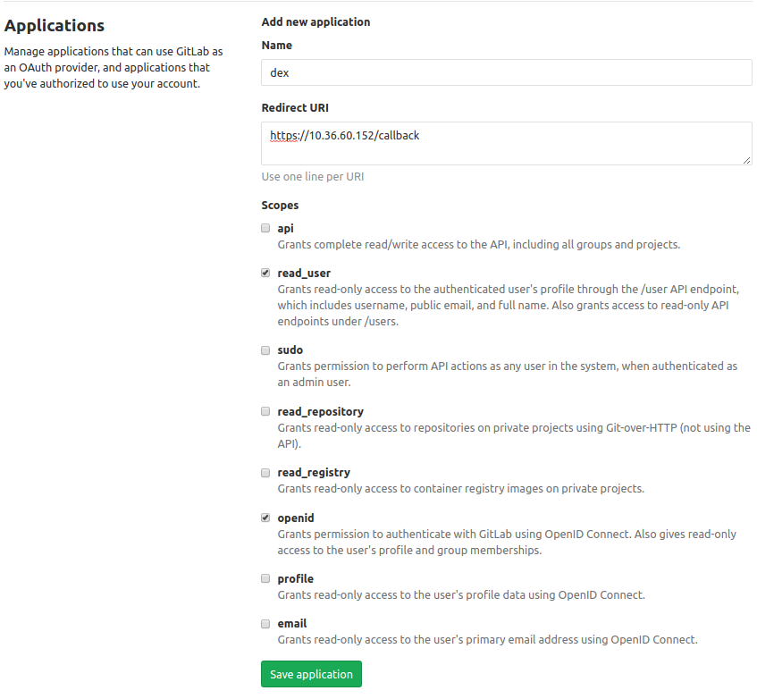
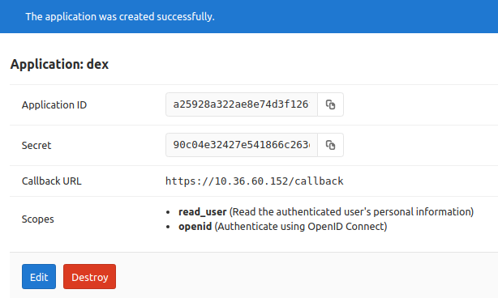
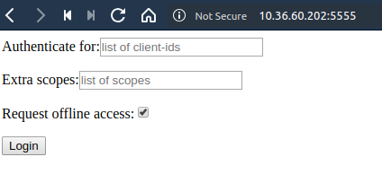
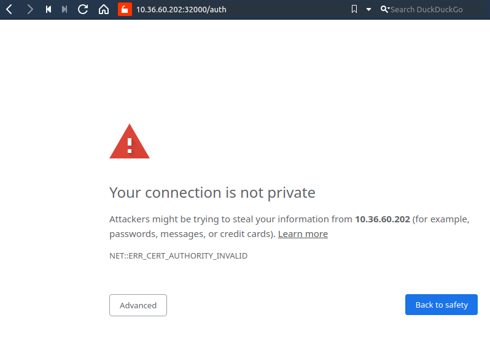
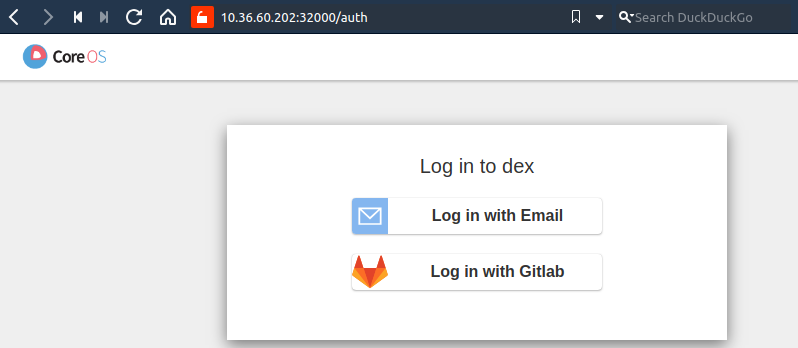
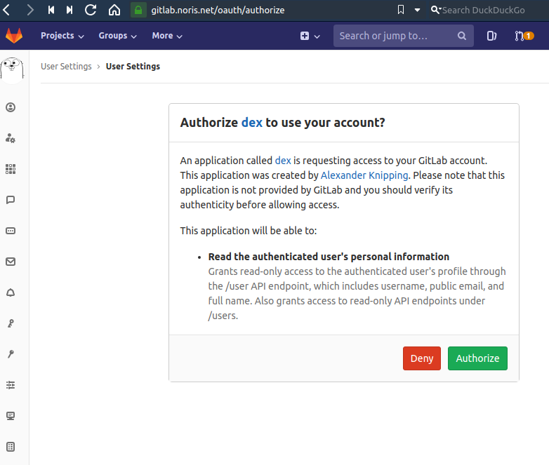
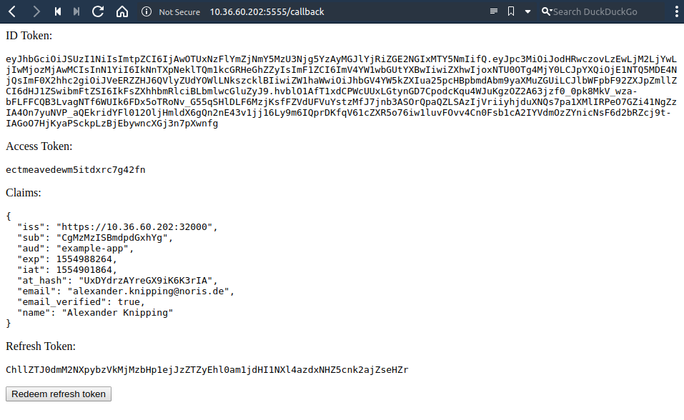

======
Addons
======

Dex
---

.. note::
  This feature is currently in beta; your mileage may vary and documentation is expected to change.

`Dex <https://github.com/dexidp/dex>`_ is an identity service that uses
`OpenID Connect <https://openid.net/connect/>`_ to drive authentication for other apps. It can
be used to authenticate against `OAuth2 <https://oauth.net/2/>`_ compatible apps such as Gitlab or
LDAP and then use this for further authentication, for example against the Kubernetes API.
This tutorial explains how to deploy Dex with koris on OpenStack.

From the `dex documentation <https://github.com/dexidp/dex#connectors>`_:

  When a user logs in through dex, the user's identity is usually stored in another user-management system:
  a LDAP directory, a GitHub org, etc. Dex acts as a shim between a client app and the upstream identity provider.
  The client only needs to understand OpenID Connect to query dex, while dex implements an array of protocols for
  querying other user-management systems.

  .. image:: static/_imgs/dex-flow.png
    :align: center
    :scale: 60%
    :alt: Dex flow as described on in the official documentation

For more information on how Dex works with OpenID Connect and OAuth2,
see: `"An overview of OpenID Connect" <https://github.com/dexidp/dex/blob/master/Documentation/openid-connect.md>`_

In this tutorial we will use Gitlab to authenticate our user against a koris cluster:

1. Setup Gitlab OAuth Authentication
2. Configure koris to use dex
3. Deploy & configure a Kubernetes cluster with koris
4. Deploy Dex and a client application for authentication against the cluster.

Prerequisites
^^^^^^^^^^^^^

General
=======

Before starting, make sure koris is installed (see :doc:`installation`) and OpenStack is configured properly
(see :ref:`prepare-openstack`). Most importantly, you will need to deploy your cluster in a network that is
able to reach your identity provider.

Additionally, create a *Floating IP* in OpenStack. This will be the address to reach your cluster. In the following
tutorial there will be values marked as ``%%FLOATING_IP%%``. **When you see this placeholder in this tutorial,
substitute it with the Floating IP that you created in OpenStack.**

Gitlab
======

This tutorial will use Gitlab as an Identity Provider, but it should work with any
`compatible connector <https://github.com/dexidp/dex/tree/master/Documentation/connectors>`_. Before getting started with
Dex, set up a *Application ID* and *Secret* on Gitlab:

1. Go to your **Gitlab User Settings** and click on **Applications**
2. Create a new Application with the following parameters:

============  ====================================
Parameter     Value
============  ====================================
Name          dex
Redirect URI  ``https://%%FLOATING_IP%%/callback``
read_user     set
openid        set
============  ====================================

Example:

3. After clicking **Save application**,  the *Application ID* and *Secret* are visible, which will be further referenced
as ``%%APP_ID%%`` and ``%%APP_SECRET%%``. **When you see either of those placeholders in this tutorial, substitute them
with the value provided from Gitlab.**

Example:

Configuration
^^^^^^^^^^^^^

Next create your koris config under the name ``test-dex.yml``:

.. code-block:: yaml

    master_flavor: 'ECS.GP1.2-8'
    node_flavor: 'ECS.GP1.2-8'

    # Adjust below according to your environment
    private_net:
      name: 'your-net'
      subnet:
        name: 'your-subnet'
        cidr: '10.32.192.0/24'
        router:
          name: 'your-router'

    cluster-name: 'test-dex'
    availibility-zones:
    - de-nbg6-1b
    - de-nbg6-1a
    n-masters: 1
    n-nodes: 1
    user_data: 'cloud-init-parts/generic'

    # Substitute with the name of your keypair in OpenStack.
    keypair: 'your-keypair'

    # Substitute with the latest koris image available.
    image: "koris-2019-04-04"

    loadbalancer:
      # Substitute here
      floatingip: "%%FLOATING_IP%%"

    certificates:
      expriry: 8760h
    storage_class: "BSS-Performance-Storage"
    pod_subnet: "10.233.0.0/16"
    pod_network: "CALICO"

    addons:
      dex:
        username_claim: email
        groups_claim: groups
        ports:
          listener: 32000
          service: 32000
        client:
          id: example-app
          ports:
              listener: 5555
              service: 32555

In order to facilitate the Dex authentication flow, two Deployments will have to be created inside our Kubernetes cluster:
one for Dex and one for a client application. In the configuration file, the ``addons.dex`` block will define the basic
configuration that is required in order to prepare a cluster to use Dex.

`Claims <https://en.wikipedia.org/wiki/Claims-based_identity>`_ are specific attributes about
a user that the identity provider returns to the client application - in this case the Email and Groups the user
belongs to.

``addons.dex.ports`` defines the ``listener`` port on which the LoadBalancer on OpenStack listens to, and the
``service`` port on the Dex Kubernetes Service listens on. The OpenStack LoadBalancer will then forward any traffic that
comes in on ``%%FLOATING_IP%%:32000`` to ``node_ip:32000``.

The block ``addons.dex.client`` defines information about the client application that requests authentication from Dex. In
this tutorial, the official `example-app <https://github.com/obitech/dex-example-app>`_ is used, which has to be registered
with Dex. *There can only be a single client application registered with Dex*, however
`cross-client trust <https://github.com/dexidp/dex/blob/master/Documentation/custom-scopes-claims-clients.md#cross-client-trust-and-authorized-party>`_
is possible.

Similar to the enclosing block, ``addons.dex.client.ports`` defines the value for the LoadBalancer ``listener`` port of the client
application, as well as the Kubernetes ``service`` port.

Deployment
^^^^^^^^^^

Next, deploy your cluster:

.. code:: shell

    $ koris apply test-dex.yml

Once it's ready, source your kubeconfig:

.. code:: shell

    $ export KUBECONFIG=test-dex-admin.conf

Before we deploy any resources, the SSL infrastructure has to be set up. Dex *needs* to run on HTTPS, which requires
a valid SSL certificate that is issued on ``%%FLOATING_IP%%``. Dex uses this certificate to sign ID Tokens it sends
to the client application, which in turn are used by the user in order to authenticate against the Kubernetes API Server.
The Kubernetes API Server has access to the Public Key the ID Token has been signed with, so it can verify that it was
indeed Dex that signed it. All necessary certificate files are generated in the folder ``certs-test-dex``
(following the syntax ``certs-<cluster-name>``).

We take those certificates, and deploy them as secrets into our cluster:

.. code:: shell

    $ kubectl create secret tls dex.tls \
        --cert=certs-test-dex/dex-client.pem \
        --key=certs-test-dex/dex-client-key.pem \
        --namespace=kube-system
    $ kubectl create secret generic dex.root-ca \
        --from-file=certs-test-dex/dex-ca.pem \
        --namespace=kube-system

Next we have to deploy the *Application ID* and *Secret* from Gitlab as Kubernetes secrets too, but **make sure to substitute
the placeholders below with your own**:

.. code:: shell

    $ kubectl create secret generic gitlab-client \
        --from-literal=client-id="%%APP_ID%%" \
        --from-literal=client-secret="%%APP_SECRET%%" \
        --namespace=kube-system

Afterwards we can create the deployments for Dex and the client application. All files are located in
``addons/dex`` and include numbered comments that refer to this tutorial. Before we edit those, let's
create a local copy from the template files:

.. code:: shell

    $ mkdir -p manifests/dex
    $ cp -r addons/dex manifests/dex

With local copies presents, let's edit ``manifests/dex/00-dex.yaml`` first. We go through the numbered comments in order:

.. code-block:: yaml

     # 1.1 Substitute this with your Floating IP
    issuer: https://%%FLOATING_IP%%:32000

    # ...

    # 1.2 (Optional): Enter the URL of your Gitlab instance
    baseURL: https://gitlab.com

    # ...

    # 1.3 The Authenticator URL (e.g. Gitlab) redirects back to dex. Substitute with with your Floating IP
    redirectURI: https://%%FLOATING_IP%%:32000/callback

    # ...

    # 1.4 The Application URL (e.g. sample-app) where dex redirects to. Substitute with with your Floating IP
    - 'http://%%FLOATING_IP%%:5555/callback'

With the manifest present, we can apply Dex into the cluster:

.. code:: shell

    $ kubectl create -f manifests/dex/00-dex.yml

We should verify everything is running as intended:

.. code:: shell

    $ kubectl get all -n kube-system -l k8s-app=dex

    NAME          TYPE       CLUSTER-IP     EXTERNAL-IP   PORT(S)          AGE
    service/dex   NodePort   10.99.212.63   <none>        5556:32000/TCP   86s

    NAME                  DESIRED   CURRENT   UP-TO-DATE   AVAILABLE   AGE
    deployment.apps/dex   1         1         1            1           86s

Next we can edit the example-app in ``manifests/dex/01-example-app.yml``. Again, **substitute the Floating IP values
accordingly**:

.. code:: yaml

      # 1. Set the Dex issuer and redirect URI
      args: ["--issuer", "https://%%FLOATING_IP%%:32000",
        "--issuer-root-ca", "/etc/dex/tls/dex-ca.pem",
        "--listen", "http://0.0.0.0:5555",
        "--redirect-uri", "http://%%FLOATING_IP%%:5555/callback"]

Now deploy it:

.. code:: shell

    $ kubectl create -f manifests/dex/01-example-app.yml

And finally, let's check for existance:

.. code:: shell

    $ kubectl get all -n kube-system -l k8s-app=dex

    NAME                                   READY   STATUS    RESTARTS   AGE
    pod/dex-example-app-678b6db4b4-clnqb   1/1     Running   0          84s

    NAME                      TYPE       CLUSTER-IP       EXTERNAL-IP   PORT(S)          AGE
    service/dex               NodePort   10.111.47.219    <none>        5556:32000/TCP   7m29s
    service/dex-example-app   NodePort   10.108.248.239   <none>        5555:32555/TCP   84s

    NAME                              DESIRED   CURRENT   UP-TO-DATE   AVAILABLE   AGE
    deployment.apps/dex               1         1         1            1           7m29s
    deployment.apps/dex-example-app   1         1         1            1           84s

    NAME                                         DESIRED   CURRENT   READY   AGE
    replicaset.apps/dex-example-app-678b6db4b4   1         1         1       84s

Afterwards, open your browser and head to ``http://%%FLOATING_IP%%:5555``:

This is the welcome screen for the example-app, which allows you to authenticate for a list of clients and
extra scopes. You don't have to enter anything here, as we are using the default values. Click on **Login** and
confirm the exception:

You will be greeted by the Dex welcome, which lets you authenticate with the identity providers we have
specified in our ``manifests/dex/00-dex.yaml``. Click on **Login with Gitlab**:

This will redirect to the Gitlab URL entered in ``manifests/dex/00-dex.yaml``. Now click **Authorize**:

After a short wait, Dex will return an ID token:

We can copy this token, export it as an environment variable and use it to authenticate against our
Kubernetes cluster:

.. code:: shell

    $ export token='copy your ID token in here'
    $ curl --http1.1 -H "Authorization: Bearer $token" -k https://%%FLOATING_IP%%:6443/api/v1/nodes

The request will fail, since no (Cluster)RoleBinding has been created yet.
In order to give your user cluster admin privileges,
edit the ``manifests/dex/02-clusterrolebinding.yml`` and enter the Email address you
have used for Gitlab:

.. code-block:: yaml

    # 1. Enter the Email you have used with your Identity Provider
    name: your-user-here

Then deploy it into the cluster:

.. code:: shell

    $ kubectl create -f manifests/dex/02-clusterrolebinding.yml

Now send the request again:

.. code:: shell

    $ curl --http1.1 -H "Authorization: Bearer $token" -k https://%%FLOATING_IP%%:6443/api/v1/nodes
    {
        "kind": "NodeList",
        "apiVersion": "v1",
    # ...

Cleanup
^^^^^^^

To remove Dex, delete all manifests:

.. code:: shell

    $ kubectl delete -f manifests/dex/

Then delete all secrets:

.. code:: shell

    $ kubectl delete -n kube-system secret dex.tls dex.root-ca gitlab-client

If you wish, you can remove the ``manifests/dex`` directory too:

.. code:: shell

    $ rm -rf manifests/dex
